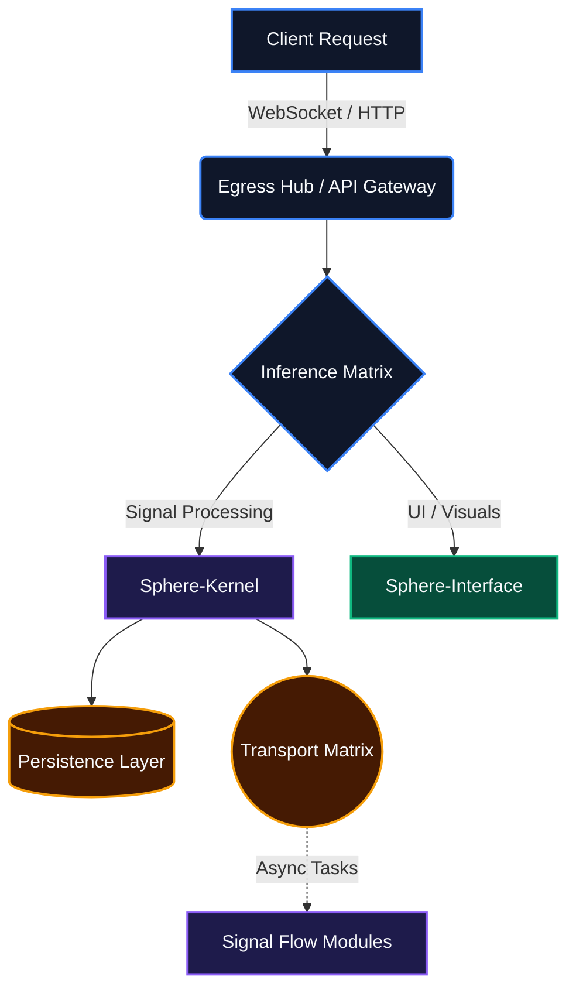

<div align="center">

```text
  _____       _                   __      __    _          
 / ____|     | |                  \ \    / /   (_)         
| (___  _ __ | |__   ___ _ __ ___  \ \  / /___  _  ___ ___ 
 \___ \| '_ \| '_ \ / _ \ '__/ _ \  \ \/ // _ \| |/ __/ _ \
 ____) | |_) | | | |  __/ | |  __/   \  /| (_) | | (_|  __/
|_____/| .__/|_| |_|\___|_|  \___|    \/  \___/|_|\___\___|
       | |                                                 
       |_|                                                 
```

**A high-performance Structural Signal Orchestration Node for real-time vocal intelligence and spectral synthesis.**

<br />

[](https://www.python.org/)
[](https://fastapi.tiangolo.com/)
[](https://nextjs.org/)
[](https://www.postgresql.org/)
[]()

</div>

<br />

---

## 🏗️ Architectural Ingress

*How signals enter the system, traverse the Inference Matrix, and exit.*



---

## ⚡ Core Capabilities

| **Feature** | **Description** | **Architecture Element** |
| :--- | :--- | :--- |
| 🚀 **Ultra-Low Latency** | Optimized end-to-end processing ensuring `<500ms` round-trip for voice synthesis and analysis. | `Sphere-Kernel` + `Transport Matrix` |
| 🛡️ **Multi-Tenant Nexus** | Robust logical separation and data isolation for concurrent organizational operations. | `Persistence Layer` (RLS) |
| 🧬 **Spectral Identity** | Advanced vocal signature processing, cataloging, and real-time generation. | `Signal Flow Modules` |

---

## 🚀 Baselines Initialization

The deployment protocol requires the initialization of the underlying containerized infrastructure.

### 1. Environment Preparation
Ensure `uv` and `docker-compose` are installed on the host system.

### 2. Transport & Persistence
Initialize the Transport Matrix and Persistence Layer.
```bash
docker-compose up -d db redis
```

### 3. Kernel Ignition (Sphere-Kernel)
Boot the Sphere-Kernel and run migrations.
```bash
cd backend
uv sync
uv run alembic upgrade head
uv run uvicorn app.main:app --host 0.0.0.0 --port 8000
```

### 4. Interface Activation (Sphere-Interface)
Launch the Sphere-Interface.
```bash
cd frontend
pnpm install
pnpm dev
```

---

## 🔐 Security Manifest

> **Access Control**
> System integrity is maintained through stringent identity verification protocols.
> Initial provisioning utilizes the following bootstrap credentials for the Global Admin identity:

- **Identity:** `admin@sphere.ai`
- **Standard:** `SphereDev2026!`

⚠️ *Note: The bootstrap standard must be rotated immediately upon the first successful Ingress.*

---

## 🟢 System Health

```terminal
[INIT] Starting SPHEREVOICE Node...
[OK]   Persistence Layer connected.
[OK]   Transport Matrix optimal.
[OK]   Sphere-Kernel listening on :8000
[OK]   Sphere-Interface listening on :3000
[INFO] System Latency baseline: 214ms
[STAT] Node Status: NOMINAL
```